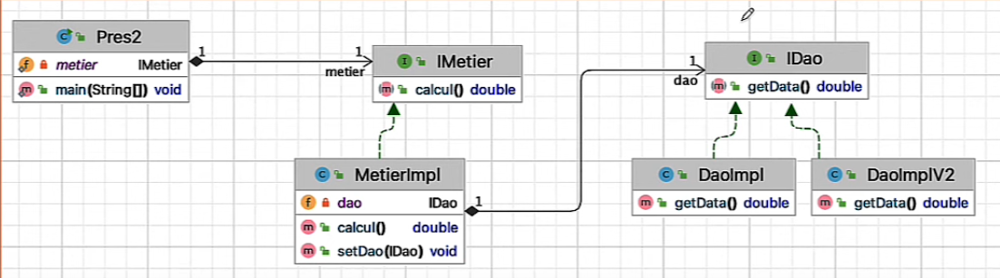

# Dependency Injection Framework

## Project Overview
This project is a practical exercise on dependency injection techniques in Java, using different strategies to manage dependencies between components. The goal is to understand how dependency injection improves flexibility, modularity, and maintainability in software development.

## Project Structure
```
FrameworkInjectionDesDependance
│── .idea/
│── src/
│   ├── main/
│   │   ├── java/
│   │   │   ├── dao/
│   │   │   │   ├── IDao.java
│   │   │   │   ├── DaoImpl.java
│   │   │   │   ├── DaoImplV2.java
│   │   │   │   ├── DaoImplV3.java
│   │   │   ├── metier/
│   │   │   │   ├── IMetier.java
│   │   │   │   ├── MetierImpl.java
│   │   │   ├── pres/
│   │   │   │   ├── PresV1.java
│   │   │   │   ├── PresV2.java
│   │   │   │   ├── PresV3.java
│   │   ├── resources/
│   │   │   ├── spring-config.xml
│── pom.xml
│── README.md
│── config.txt
```

## Dependency Injection in the Project
The project demonstrates different ways to implement dependency injection in Java through three versions of the `Pres` class:

### **1. PresV1.java** - Manual Dependency Injection (Static)
In this version, dependencies are instantiated manually within the `PresV1` class. This approach makes it difficult to modify or extend the implementation without changing the source code.

```java
IDao dao = new DaoImpl();
IMetier metier = new MetierImpl(dao);
```

### **2. PresV2.java** - Dynamic Dependency Injection Using Configuration File and Spring XML (Dynamique + Spring(XML))
This version improves flexibility by dynamically injecting dependencies using a configuration file (config.txt) and Spring XML. This allows modifications without altering the source code.

- 2.1. Using `config.txt`
```java
 try {
   // Create Scanner to read configuration from file
   Scanner cn = new Scanner(new File("config.txt"));
   String daoClassName = cn.nextLine();
   String metierClassName = cn.nextLine();

   // Load Dao class dynamically using reflection
   Class cDao = Class.forName(daoClassName);
   IDao oDao = (IDao) cDao.getDeclaredConstructor().newInstance();

   // Load Metier class dynamically and inject Dao instance using constructor
   Class cMetier = Class.forName(metierClassName);
   IMetier oMetier = (IMetier) cMetier.getConstructor(IDao.class).newInstance(oDao);
```
- 2.2. Using `spring-config.xml` Spring(XML)
```java
try {
   // Load Spring context from XML configuration
   ApplicationContext context = new ClassPathXmlApplicationContext("spring-config.xml");

   // Retrieve the 'metier' bean from the Spring context
   IMetier metier = context.getBean("metier", IMetier.class);

   // Perform calculation and print result
   double callRes = metier.calcul();
   System.out.println("Calculation Result (Spring Version): " + callRes);
} catch (Exception e) {
   System.out.println("Something went wrong in Spring Version! \n>Erreur: " + e.getMessage());
}
```
Additionally, dependency definitions can be managed using an external configuration file to dynamically specify implementations at runtime.


### **3. PresV3.java** - Dependency Injection (Spring(Annotations))
The final version uses Spring annotations such as `@Service`, `@Controller`, and `@Autowired` to manage dependency injection, making the configuration more concise and eliminating the need for explicit XML configuration.
```java
@Service
public class MetierImpl implements IMetier {
@Autowired
@Qualifier("daoImpl") // select your version or remove @Component from other classes
private IDao dao;
}
```

This approach further improves modularity and reduces the need for manual dependency configuration.

## Class Relationships
Below is an image representing the relationships between the classes in the project. Place your diagram here:

****

## Running the Project
1. Compile the project:
   ```sh
   mvn clean install
   ```
2. Run the desired presentation class:
   ```sh
   java -cp target/classes pres.PresV1
   ```
   or
   ```sh
   java -cp target/classes pres.PresV2
   ```
   or
   ```sh
   java -cp target/classes pres.PresV3
   ```

## Conclusion
This project illustrates different techniques for dependency injection, showcasing the advantages of using frameworks like Spring to improve modularity and maintainability. The evolution from `PresV1` to `PresV3` demonstrates how software design can be improved by reducing tight coupling between components.


